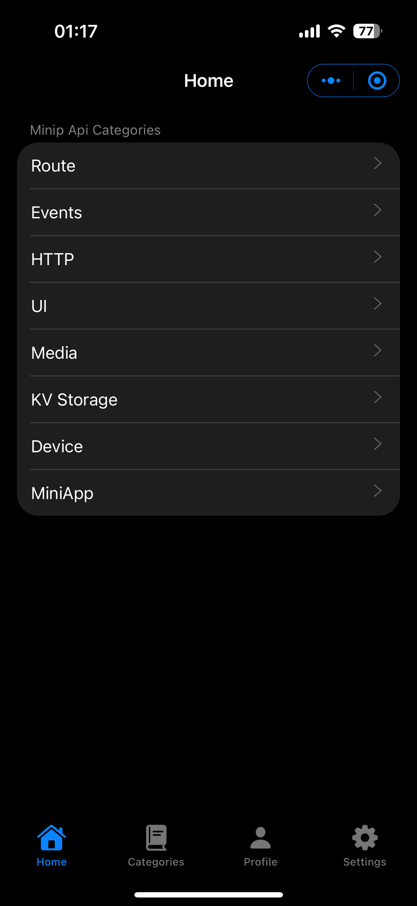
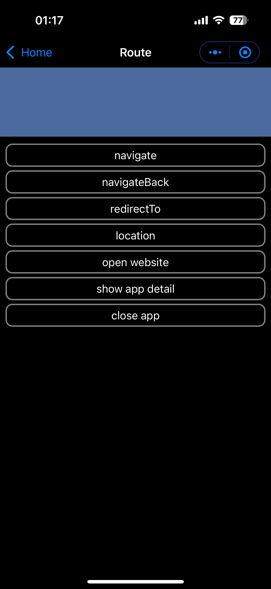
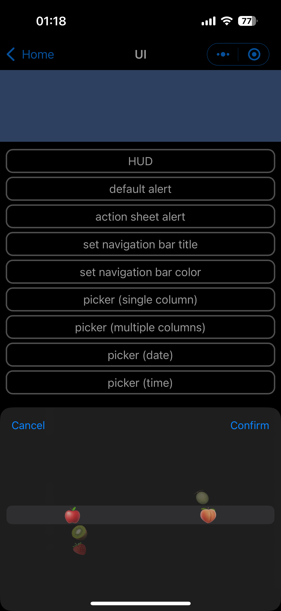

# Minip

Minip is an app that allows you to run frontend applications on your phone, giving them a native app-like experience. You can interact with native features via a JavaScript bridge.

<a href="https://apps.apple.com/us/app/minip-editor/id6463115915" target="_blank"></a>

## Project Structure

- `ios/` — iOS app
- `packages/bridge/` — JavaScript bridge SDK ([npm](https://www.npmjs.com/package/minip-bridge))
- `packages/demo/` — Demo mini app
- `packages/language-service-bundler/` — Language service for code editor

## Demo

Scan this QR code using the Minip App to install the demo:


### Screenshots

|                                |                                |                                |
| ------------------------------ | ------------------------------ | ------------------------------ |
|  |  |  |

## Minip Bridge Quick Start

Install the bridge SDK:

```bash
npm i minip-bridge
```

```javascript
import { navigateTo } from "minip-bridge";
navigateTo({ page: "index.html", title: "title" });
```
